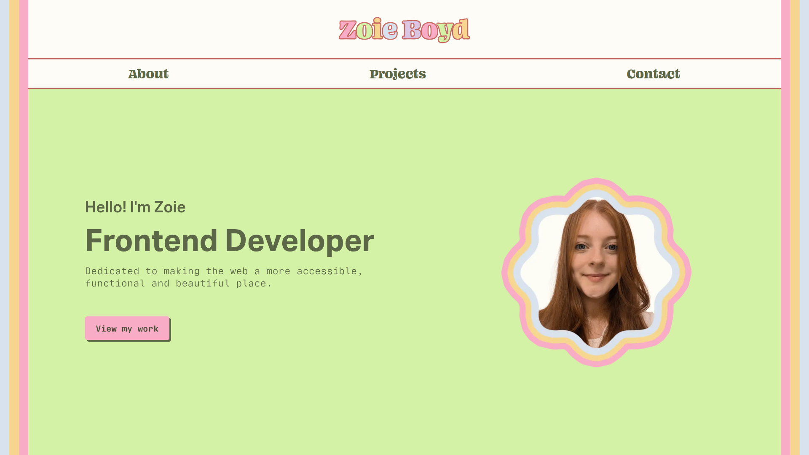
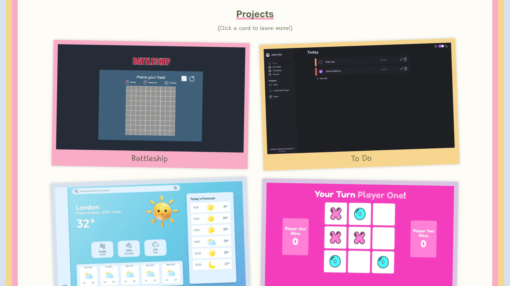
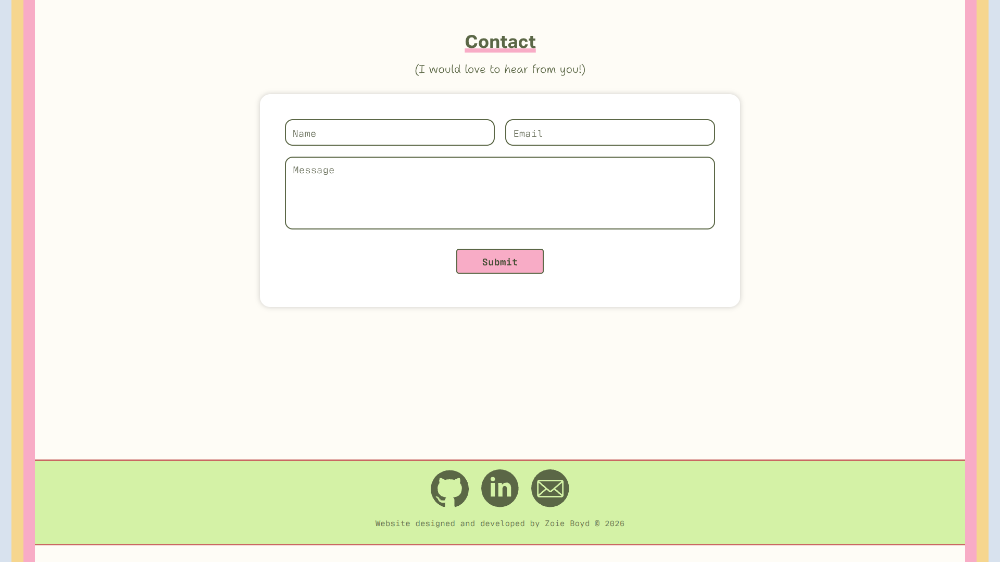
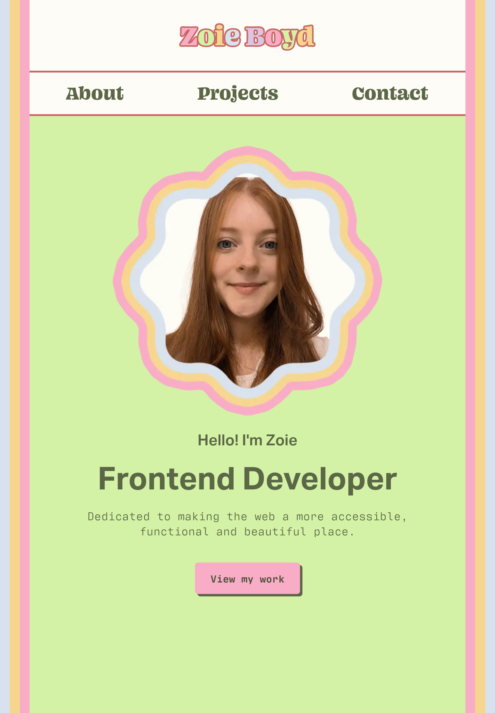
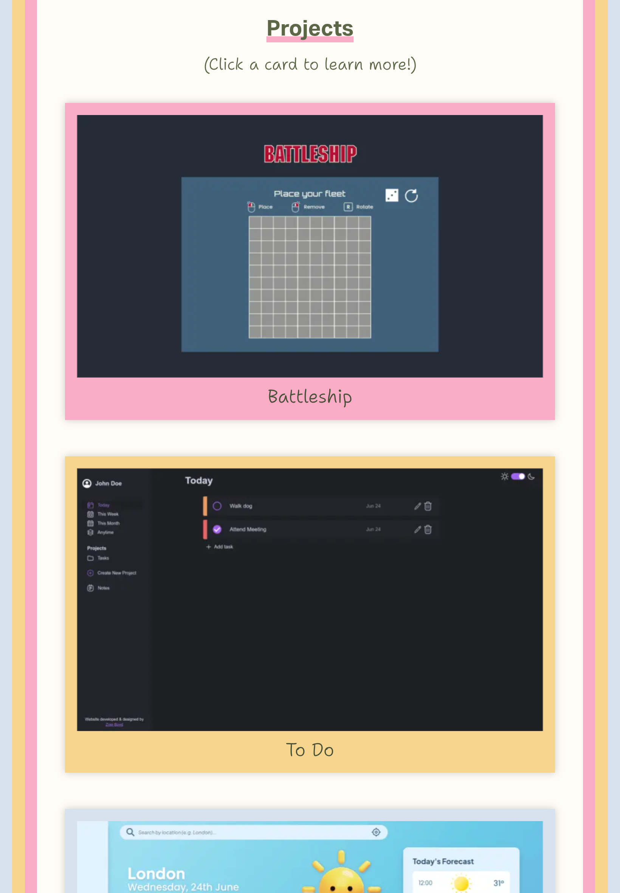
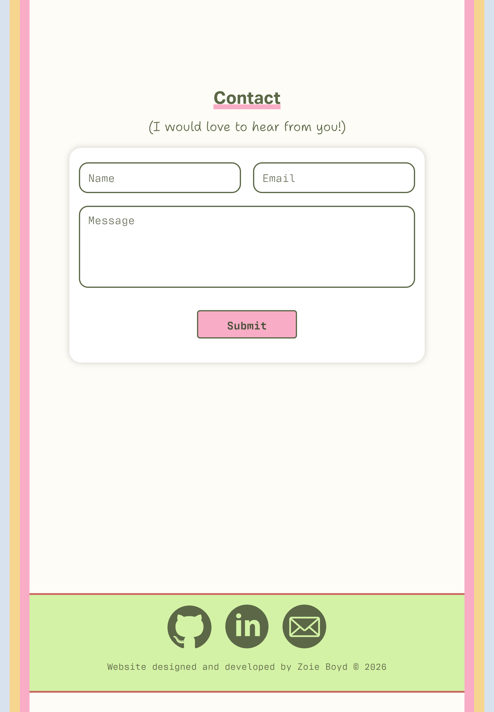
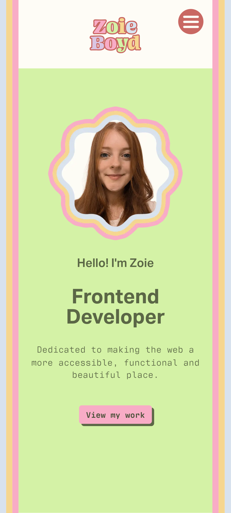
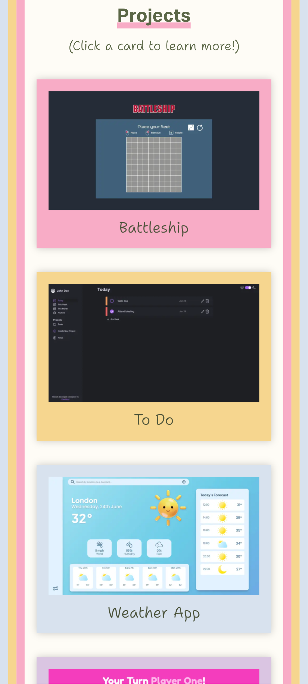
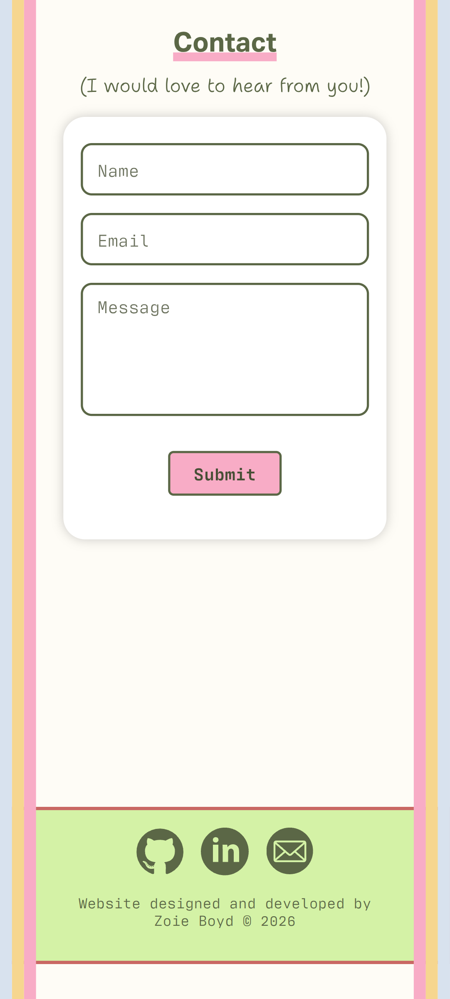

# My Personal Homepage

A web-developer homepage built from scratch using core, vanilla web technologies to showcase front-end skills and capabilities. Created to complete The Odin Project's Advanced HTML and CSS section.

🌐 [View Live Demo](https://zoieboyd.github.io/homepage/)

## Features

- Animations and Transitions including JavaScript Intersection Observer scroll effects to increase interactivity and visual appeal.
- Semantic HTML Structure allowing for optimal screen reader navigation and a maintainable document hierarchy.
- Designed to meet WCAG AA standards using accessible color contrast, ARIA and complete keyboard navigation.
- Responsive across most modern viewports using CSS Flexbox, Grid, clamp() and media queries.

## Technologies Used

- HTML
- CSS
- JavaScript
- Webpack
- Figma

## Gallery

### Desktop

---

### Tablet

---

### Mobile

## Assignment Instructions

[Instructions provided by The Odin Project](https://www.theodinproject.com/lessons/node-path-advanced-html-and-css-homepage)

**Step 1: Set up and planning**

1. Set up your HTML and CSS files with some dummy content, just to make sure you have everything linked correctly.
2. Download a full-resolution copy of the design files (desktop design file, tablet design file, mobile design file), and get a general idea for how you’re going to need to lay things out in your HTML document.

**Step 2: Gather Assets**

1. The portraits we’ve used in the design files are stock photos downloaded from pexels.com. If you don’t have a picture of yourself handy, feel free to go grab a placeholder for now.
2. Select your fonts! We’re using Playfair Display and Roboto in the design, both available with Google fonts.
3. In the design, we have icon-links for GitHub, LinkedIn, and X (formerly known as Twitter). Obviously, feel free to add whatever links you want to your own site. We got those icons from https://devicon.dev/.
4. Other icons (phone, email, and external link) were downloaded as SVGs from https://materialdesignicons.com/.

**Step 3: Some tips!**

1. As you might expect, you can organize your work on this project however you please. We’ve given you many tips over the past several lessons, and you are likely already comfortable starting from a blank page.
2. If you like being told what to do: The author of this lesson feels most comfortable starting out with the larger sections of the layout, and then working from the top of the page to the bottom. In other words, get the various sections in more or less the right place (header, projects, contact, etc.) while ignoring a lot of specific style and content details, then go back through from the top-to-bottom filling-in, styling, and cleaning up everything.
3. It doesn’t matter when or how you accomplish the responsiveness of this project, as long as your layout doesn’t break for viewports between 320 and 1,920 pixels wide. There are people who will tell you that you should always start with the mobile experience and then use media queries to tell your layout how to expand. The ‘mobile-first’ crew does have some good points (Google it!), but in the end, how you accomplish it doesn’t matter as long as it works. Good luck!
4. When you’re done, don’t forget to push it to GitHub and use GitHub Pages to publish it to the world! You should be proud of what you’ve accomplished here!
